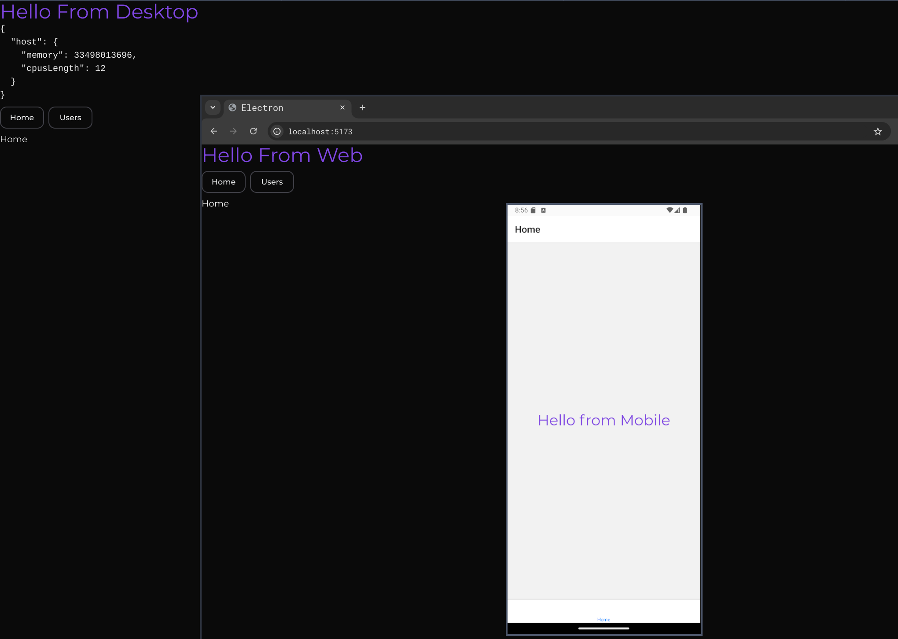

# Web, Desktop & Mobile Monorepo

### Stack

- Vite as a Bundler for web & desktop
- Expo & Expo Router for mobile
- Tanstack Router for file based routing for web & desktop
- TailwindCSS for web & desktop. NativeWind sharing the same tailwind config file for mobile.
- pnpm workspace for monorepo setup
- Nx as a unified build system (Can be replaced with Turbo. Just remove nx package and add Turbo and it's config file)

