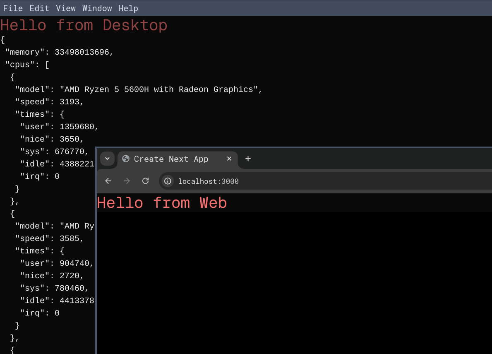

# Web and Desktop Monorepo

## Web and Desktop monorepo app using Next.js 14 and Electron.js

### Stack

- pnpm workspace for monorepo setup
- Turbo as a unified build system
- Next.js 14 as a frontend layer
- Electron as a desktop layer

</img>
